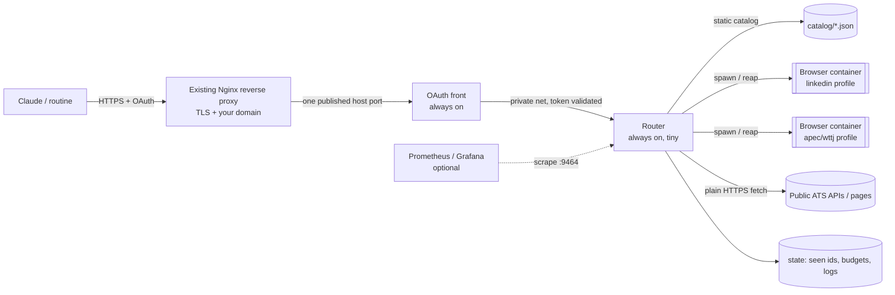

# 00 — Overview

> **Related docs:** Load for orientation. Also load: `16-architecture-diagrams.md` (visuals); `01` if you need a decision's rationale; `09` for security questions; `07` for LinkedIn lessons. Not needed for coding a single module. Follow a link only if the task needs it.

## Why this exists
The daily job-search routine (see `../00-orchestrator.md`) currently reads LinkedIn, WTTJ and APEC through the **Claude in Chrome extension on Matthieu's MacBook**. That makes every run depend on the laptop being awake, Chrome open and logged in, the extension connected, and a long multi-step browser conversation that burns tokens and breaks often (lessons in `07-adapter-linkedin.md`).

The orchestrator moves that work to an always-on home Ubuntu machine, behind a small number of **task-level MCP tools**. Claude (including scheduled routines) calls them over the internet through a custom connector.

## Goals
1. Remove the laptop/Chrome-extension dependency from the routine.
2. Expose **few, compact, read-only tools** that return structured results (cheap in tokens, stable across site changes).
3. Be **secure**: OAuth 2.1 in front, single authorized user, read-only tool surface, hardened containers, egress allowlist.
4. Be **cheap to run on limited RAM**: nothing runs when idle; a browser is spawned on demand and stopped after a short grace period.
5. Be **extensible**: adding a platform = add a catalog entry + an adapter (no new image).

## Non-goals
- Not a general-purpose MCP gateway/aggregator (no third-party MCP servers to proxy).
- Not a generic browser-automation MCP (no arbitrary navigation/clicking/evaluating by the client).
- No write actions on any platform (no apply, no messages, no profile edits).
- No multi-user support in v1 (single authorized account).
- No attempt to defeat site protections beyond behaving like a normal, low-volume, logged-in user (see `09-security.md` for the terms-of-service caveat).

## Constraints
- Host: real Ubuntu machine at Matthieu's home (trusted residential IP — important for LinkedIn), **limited RAM** (exact figure unknown: measure in Phase 0), always on.
- Claude connects from Anthropic's cloud: the endpoint must be public HTTPS with OAuth or a supported static header (see `02-…`).
- Must work from **scheduled routines** (unattended). VERIFY: custom connectors are usable from scheduled tasks (Phase 0 spike S1).
- Only one LinkedIn account, Matthieu's own; keep volume human-scale.

## Architecture (logical)

Detailed diagrams (deployment, router internals and adapter plug-in, call sequence, state machine, routine integration): `16-architecture-diagrams.md`.

Always-on: OAuth front, router (Nginx is your existing one, outside this stack) (a few tens to low hundreds of MB in total, to measure). On-demand: browser containers (one at a time globally).

## Request flow (tools/call, browser-backed)
1. Claude calls `linkedin_search` with arguments.
2. OAuth front validates the bearer token and forwards to the router over the private network.
3. Router validates arguments against the catalog schema, checks the rate limiter and circuit breaker.
4. Router acquires the global browser semaphore; if another platform's browser is idle in its grace period it is stopped immediately (preemption).
5. Router ensures the platform's browser container is running (spawn from the shared image with the platform's profile volume), waits until the DevTools endpoint answers.
6. Router opens ONE working tab, runs the adapter (navigate to an allowlisted URL, run extraction JS in the page, parse), closes the tab.
7. Router returns structured JSON + a compact text summary; starts/refreshes the idle timer (default 120 s).
8. After the idle timer expires: graceful close → SIGTERM → SIGKILL → container removed. Profile volume stays.

`tools/list` never starts anything (static catalog).

## Glossary
- **Adapter**: code + static metadata that knows how to extract data from one platform (JS run in the page + TypeScript parsing/normalization).
- **Catalog**: the set of static tool definitions (JSON schema for inputs, output shape, limits, which adapter and platform).
- **Runtime**: a spawned browser container for one platform.
- **Grace period / TTL**: time a runtime stays alive after its last call (default 120 s).
- **Preemption**: stopping an idle-in-grace runtime early because another platform needs the RAM.
- **Checkpoint**: LinkedIn security challenge (captcha/verification) that invalidates automation until the user resolves it manually.
