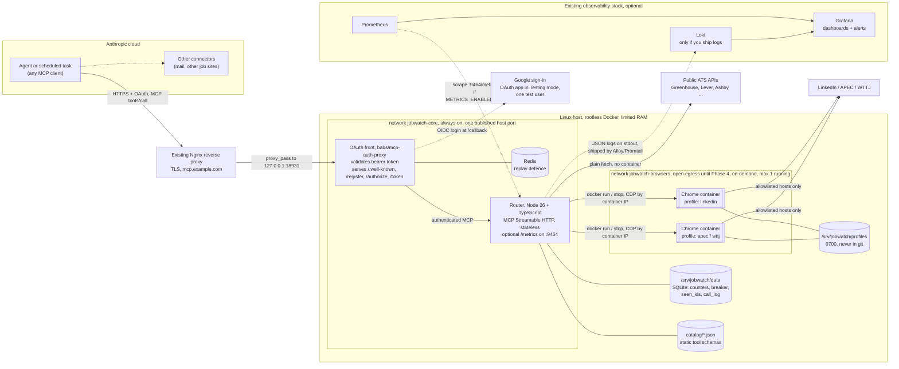
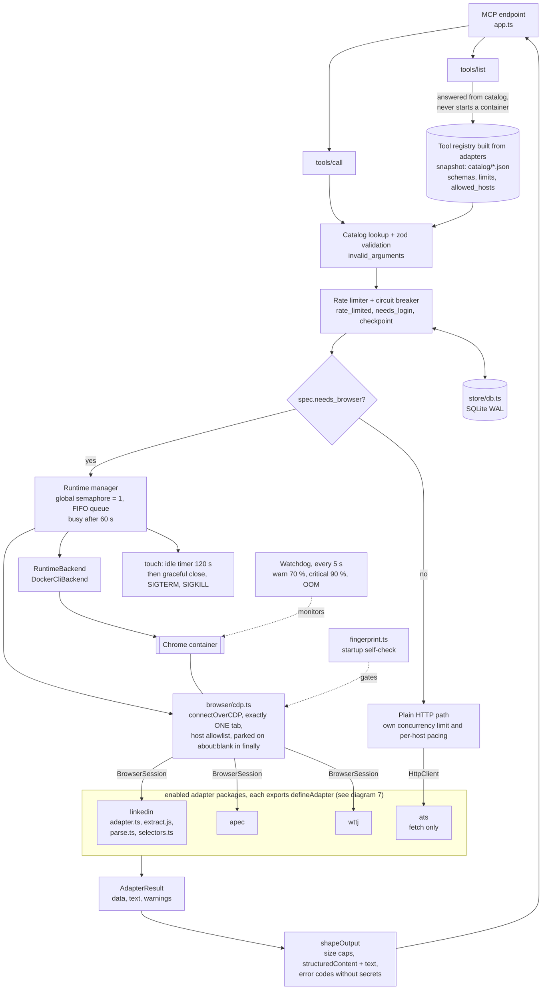
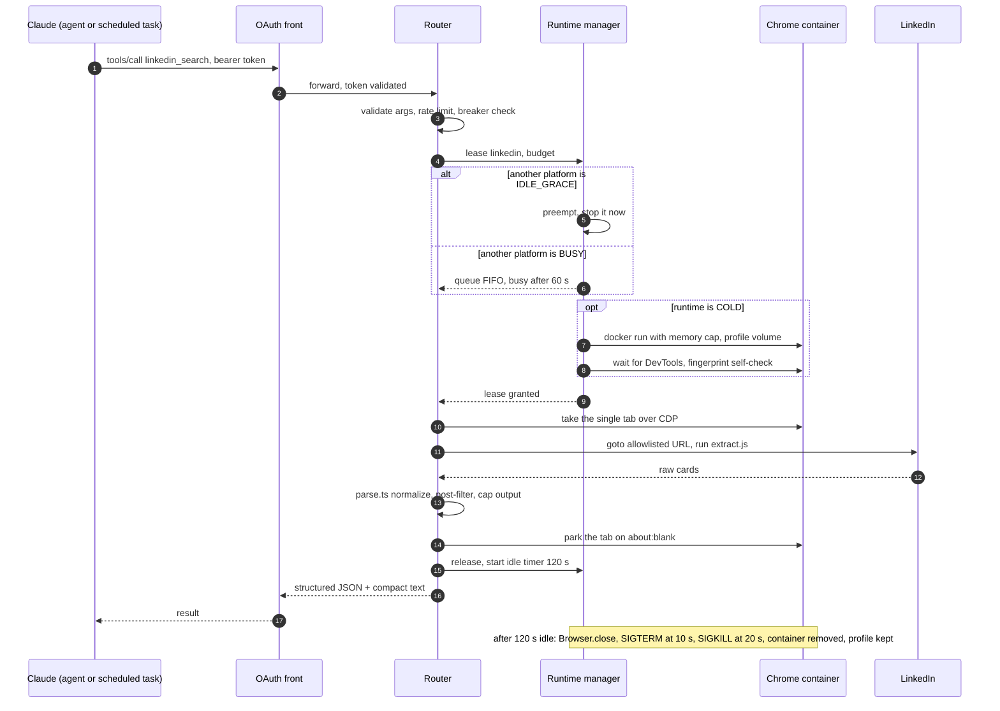
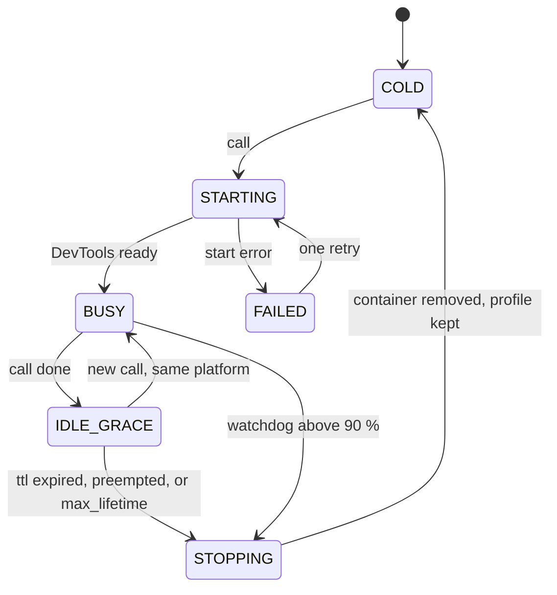
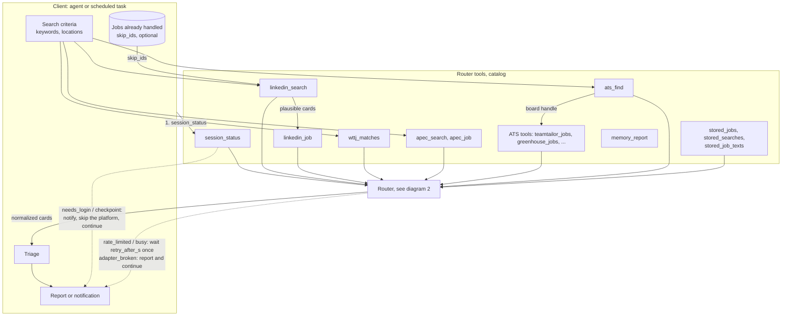
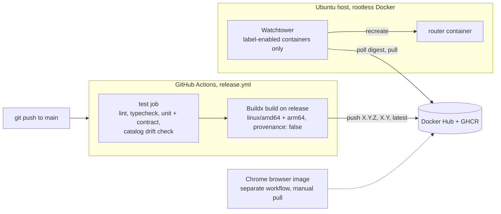
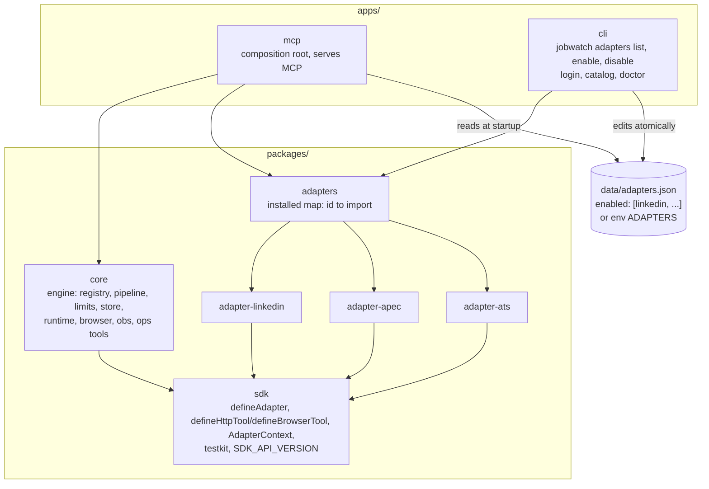

# 16 — Architecture diagrams

> **Related docs:** Load for the visual picture. Also load: `00` (overview), `03` (router spec wins on conflicts), `06` (state machine), `10` (deployment and CI), `13` (using the tools from a client). Follow a link only if the task needs it.

Visual companion to `00-overview.md`, `03-router-spec.md`, `06-…` and `13-…`. If a diagram and a numbered spec disagree, the spec wins; fix the diagram.

## 1. Overall system (deployment view)

Notes:
- Nginx is your existing reverse proxy, outside this stack. It is the only public entry point, and the front is the only service behind a published host port.
- Browser containers are not in compose. The router spawns them on demand, with a memory cap, and reaps them after the idle grace period.
- Prometheus and Grafana are your existing instances. The metrics endpoint is off by default, runs on its own port (not behind Nginx or the front), and Prometheus pulls from it. Grafana shows logs only if they are shipped to Loki; Prometheus itself stores metrics, not log lines.
- Other connectors (mail, other job sites) stay separate and do not go through the router.

## 2. Router internals and how adapters plug in

Adapters are the per-platform "sub routines". The router owns everything generic (validation, limits, lifecycle, output shaping). An adapter only knows how to turn validated arguments into a result for one platform.

To add a platform (diagram 7 shows the packages):
1. `npm run new:adapter -- <id>` (or `npm run new:utility -- <id>` for a helper module that fetches no jobs) creates `packages/adapter-<id>` (`packages/utility-<id>`), adds one line to the matching map in `packages/mcp-modules` and writes the first catalog snapshot.
2. Write the tools with `defineHttpTool` or `defineBrowserTool`, add fixtures and a contract test using `@jobwatch/sdk/testkit`.
3. `npm run catalog:gen` after every change to a tool, commit the snapshot, then `jobwatch adapters enable <id>` and restart the router.

Only enabled adapters reach `tools/list`. Handlers only receive `AdapterContext` (`BrowserSession`, `HttpClient`, `pace`, `log`), so no generic `navigate` or `evaluate` tool is ever exposed and the host allowlist cannot be bypassed.

## 3. One browser-backed call (sequence)

## 4. Runtime state machine (per platform)

## 5. How a client plugs into the router

A client keeps its own profile, triage and memory. Only the "read sources" step goes through the router; each source becomes one or a few tool calls.

If the connector is unreachable, the client reports every browser source as failed and retries later (see `13-…`).

## 6. Deployment pipeline (release to the host)

Only the router auto-updates. The OAuth front is pinned by digest, and the browser image is updated by hand. After a restart the router reaps leftover `jobwatch.managed=true` containers.

## 7. Workspace packages and registration (Nx monorepo)

Allowed dependency directions only (enforced by Nx module boundaries): adapters depend on `sdk` and nothing else, so they can never reach the engine, the browser library or Node's network and file APIs directly. `core` never imports an adapter: the server hands it the enabled ones by name.
